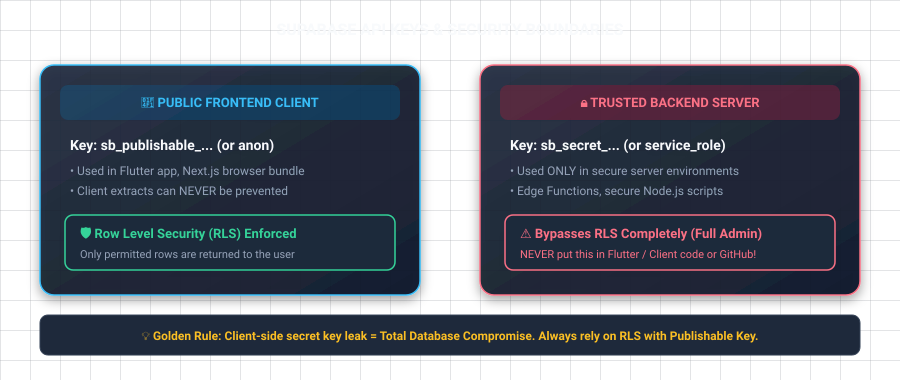

# 02 — Project Setup Recap

## ဒီ chapter မှာ ဘာတွေ လုပ်မှာလဲ

- Flutter setup ကို clean ဖြစ်အောင် ပြန်စစ်မယ်
- `publishable` key နဲ့ `service_role`/secret key ဘာကွာလဲ သိမယ်
- Next.js App Router client ကို setup လုပ်မယ်
- "retrying to connect" log ကို ဘယ်အချိန် စိုးရိမ်ရမလဲ သိမယ်

## မင်းလုပ်ထားပြီးသား Flutter setup

`supabase_flutter` က Supabase client, auth-session persistence, Realtime support တွေကို Flutter အတွက်ပေးထားတဲ့ package ပါ။ App စမောင်းခင် initialize လုပ်ရမယ်။

```dart
import 'package:flutter/widgets.dart';
import 'package:flutter_dotenv/flutter_dotenv.dart';
import 'package:supabase_flutter/supabase_flutter.dart';

Future<void> main() async {
  WidgetsFlutterBinding.ensureInitialized();
  await dotenv.load(fileName: '.env');

  await Supabase.initialize(
    url: dotenv.env['SUPABASE_URL']!,
    publishableKey: dotenv.env['SUPABASE_PUBLISHABLE_KEY']!,
  );

  runApp(const MontTaeApp());
}

final supabase = Supabase.instance.client;
```

`.env`:

```env
SUPABASE_URL=https://your-project-ref.supabase.co
SUPABASE_PUBLISHABLE_KEY=sb_publishable_xxxxxxxxx
```

`pubspec.yaml` ထဲမှာ `.env` asset ထည့်ထားရမယ်။

```yaml
flutter:
  assets:
    - .env
```

**Big-bro truth:** mobile app ထဲက publishable key ကို extract လုပ်လို့ရတယ်။ `.env` ထဲထည့်ထားတာက secret ဖြစ်သွားတာ မဟုတ်ဘူး။ ဒါကြောင့် security အစစ်က RLS policies ပဲ ဖြစ်တယ်။

## API keys ကို မမှားပါနဲ့



| Key | ဘယ်မှာသုံး | RLS |
|---|---|---|
| `sb_publishable_...` | Flutter, browser, public frontend | bypass မလုပ်ဘူး |
| legacy `anon` JWT | old client tutorials | publishable key နဲ့ role တူတူ |
| `sb_secret_...` | trusted server only | RLS bypass လုပ်နိုင်တယ် |
| legacy `service_role` JWT | trusted server only | RLS bypass လုပ်နိုင်တယ် |

`sb_secret_...` သို့မဟုတ် `service_role` ကို Flutter, React, Next.js browser bundle, Git repo, screenshot, chat ထဲ **မထည့်ရ**။ Leak ဖြစ်ရင် attacker က RLS ကိုကျော်ပြီး database အကုန်ဖတ်/ဖျက်နိုင်တယ်။

Supabase dashboard ရဲ့ **Project Settings -> API Keys** မှာ current publishable key ရနိုင်တယ်။ Tutorial အဟောင်းတွေမှာ `anon key` လို့ တွေ့နိုင်ပေမဲ့ new project အတွက် publishable key ကို သုံးပါ။

## "Retrying to connect" ဆိုတာ

ဒါက များသောအားဖြင့် Supabase **Realtime WebSocket** client က connection ပြတ်ပြီး reconnect လုပ်ဖို့ ကြိုးစားနေတယ်ဆိုတဲ့ log ပါ။ `channel()` သို့မဟုတ် `.stream()` မသုံးသေးရင် app logic အတွက် အရေးမကြီးတတ်ဘူး။

အမြဲဖြစ်နေပြီး data request တွေပါ fail နေရင် ဒီအစဉ်နဲ့စစ်:

1. ဖုန်း/emulator မှာ internet ရှိလား။
2. `SUPABASE_URL` မှာ `https://` ပါလား၊ project ref မှန်လား။
3. project က paused ဖြစ်နေလား (free project inactivity)။
4. proxy, firewall, VPN က WebSocket ကိုပိတ်နေလား။
5. actual error message ကို log မှာ reconnect message အပေါ်နားကနေဖတ်ပါ။

`Supabase.initialize()` တစ်ခုတည်းနဲ့ database connection အမြဲဖွင့်မထားဘူး။ Query လုပ်ချိန် HTTP request လုပ်တယ်; Realtime subscribe လုပ်မှ persistent WebSocket လိုတယ်။

## Next.js setup

```bash
npm install @supabase/supabase-js @supabase/ssr
```

`.env.local`:

```env
NEXT_PUBLIC_SUPABASE_URL=https://your-project-ref.supabase.co
NEXT_PUBLIC_SUPABASE_PUBLISHABLE_KEY=sb_publishable_xxxxxxxxx
```

`NEXT_PUBLIC_` ပါတာက browser ပို့မယ်ဆိုတဲ့ အဓိပ္ပာယ်ပါ။ Publishable key အတွက်သာ အဆင်ပြေတယ်။

`lib/supabase/client.ts`:

```ts
import { createBrowserClient } from '@supabase/ssr'

export function createClient() {
  return createBrowserClient(
    process.env.NEXT_PUBLIC_SUPABASE_URL!,
    process.env.NEXT_PUBLIC_SUPABASE_PUBLISHABLE_KEY!
  )
}
```

Browser client ကို Client Component မှာသုံးမယ်။ Server Component, Server Action, Route Handler အတွက် cookie-aware `createServerClient` လိုတယ်။ Auth chapter မှာ complete SSR setup နဲ့ `proxy.ts` session refresh ကိုလုပ်မယ်။

## ညီလေး — သတိထားရမယ့်

- `.env` ကို `.gitignore` ထဲ ထည့်ပါ။ ဒါပေမဲ့ publishable key leak ကို gitignore က security boundary လို့ မထင်ပါနဲ့။
- Flutter app မှာ `!` သုံးတာ setup နမူနာအတွက် OK ပေမဲ့ production မှာ missing env ကို friendly startup error ပေးတာကောင်းတယ်။
- Dashboard URL နဲ့ API URL မတူဘူး။ Client အတွက် `https://<ref>.supabase.co` ကိုသုံးရတယ်။

## လေ့ကျင့်ခန်း

`main()` ပြီးနောက် `debugPrint(supabase.supabaseUrl);` ခဏထည့်ပြီး correct project URL ထွက်တာစစ်ပါ။ ပြီးရင် debug print ကိုဖျက်ပါ။

<< Previous: [01 Overview](./01-supabase-overview.md) | Next: [03 Database Fundamentals](./03-database-fundamentals.md) >>
