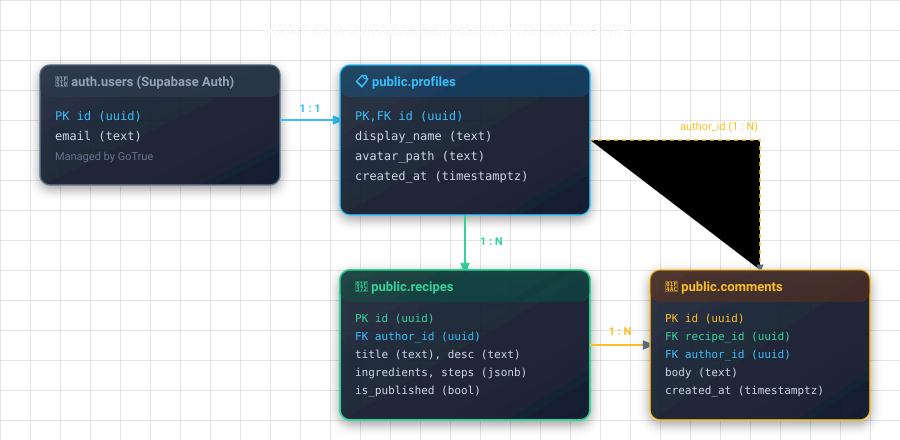

# 03 — Postgres Database Fundamentals

## ဒီ chapter မှာ ဘာတွေ လုပ်မှာလဲ

- Postgres ကို Express developer angle ကနေ နားလည်မယ်
- Mont-Sha အတွက် `profiles`, `recipes`, `comments` schema ဆောက်မယ်
- UUID, foreign key, timestamp, constraint ကို practical သိမယ်

## Postgres mindset

Postgres က SQL database တစ်ခုထက် ပိုတယ်: strong types, constraints, transactions, JSONB, full-text search, extensions တွေပါတယ်။ ဒီ course မှာ relational basics ကို အရင်မှန်အောင်ဆောက်မယ်။

Naming rule: table/column တွေကို **lowercase `snake_case`** သုံးပါ။ `recipeTitle` မဟုတ်, `recipe_title` သုံးပါ။ Postgres က quoted camelCase ကို အမြဲ quote လုပ်ရလို့ စိတ်ညစ်တတ်တယ်။

## Data type cheat sheet

| Type | ဘယ်အတွက် |
|---|---|
| `uuid` | public ID / primary key |
| `text` | title, description, URL |
| `integer` | count, minutes |
| `boolean` | true/false flags |
| `timestamptz` | timezone ပါတဲ့ date/time |
| `jsonb` | flexible structured data; default choice over `json` |

`timestamptz` ကို `timestamp` ထက် user-generated event တွေအတွက် ရွေးပါ။ Backend က UTC မှာသိမ်းပြီး client က local timezone နဲ့ပြမယ်။

## Mont-Sha schema

SQL Editor မှာ တစ်ခါတည်း run ပါ။ `gen_random_uuid()` က Supabase Postgres မှာ available ဖြစ်တယ်။

```sql
create table public.profiles (
  id uuid primary key references auth.users(id) on delete cascade,
  display_name text not null check (char_length(display_name) between 2 and 60),
  avatar_path text,
  created_at timestamptz not null default now()
);

create table public.recipes (
  id uuid primary key default gen_random_uuid(),
  author_id uuid not null references public.profiles(id) on delete cascade,
  title text not null check (char_length(title) between 3 and 140),
  description text not null,
  ingredients jsonb not null default '[]'::jsonb,
  steps jsonb not null default '[]'::jsonb,
  cover_image_path text,
  prep_minutes integer check (prep_minutes > 0),
  is_published boolean not null default false,
  created_at timestamptz not null default now(),
  updated_at timestamptz not null default now()
);

create table public.comments (
  id uuid primary key default gen_random_uuid(),
  recipe_id uuid not null references public.recipes(id) on delete cascade,
  author_id uuid not null references public.profiles(id) on delete cascade,
  body text not null check (char_length(body) between 1 and 500),
  created_at timestamptz not null default now()
);

create index recipes_author_id_idx on public.recipes(author_id);
create index comments_recipe_id_created_at_idx
  on public.comments(recipe_id, created_at);
```

### Relationship map



`auth.users` ကို app table လို မပြင်ပါနဲ့။ Supabase Auth ပိုင်တဲ့ schema ပါ။ App-visible extra data အတွက် `public.profiles` ကို `id` တူတူနဲ့သုံးတယ်။

## JSONB ကို ဘယ်လိုသုံးမလဲ

Ingredients/steps က array length မတည်ငြိမ်လို့ `jsonb` က practical ဖြစ်တယ်။

```json
{
  "ingredients": [
    { "name": "rice flour", "amount": "2 cups" },
    { "name": "coconut milk", "amount": "1 cup" }
  ],
  "steps": ["Mix ingredients", "Steam for 20 minutes"]
}
```

Search/filter/join အမြဲလုပ်ရမယ့် data ကို JSONB ထဲမသိမ်းပါနဲ့။ ဥပမာ recipe categories, likes လို relation က table သီးသန့်က ပိုမှန်တယ်။ "schema မသိသေး/variable shape" ဆိုရင် JSONB, "relationship/query လို" ဆိုရင် table လို့ မှတ်ပါ။

## `updated_at` ကို automatic ပြင်ပေးရန်

Postgres မှာ `default now()` က insert အချိန်တစ်ခါပဲ run တယ်။ Update တိုင်း timestamp ပြင်ဖို့ trigger လိုတယ်။

```sql
create function public.set_updated_at()
returns trigger
language plpgsql
as $$
begin
  new.updated_at = now();
  return new;
end;
$$;

create trigger set_recipes_updated_at
before update on public.recipes
for each row execute function public.set_updated_at();
```

## ညီလေး — သတိထားရမယ့်

- Foreign key မရှိရင် orphan rows, broken joins ဖြစ်တတ်တယ်။ relation ရှိရင် DB ကို enforce လုပ်ခိုင်းပါ။
- `on delete cascade` က parent ဖျက်ရင် child အကုန်ဖျက်မယ်။ Recipe delete မှာ comments ဖျက်တာကောင်းပေမဲ့ financial/audit data မှာ မစဉ်းစားဘဲမသုံးပါနဲ့။
- Index ကို query pattern ပေါ်မူတည်ပြီးထည့်ပါ။ index များလွန်းရင် writes နှေးတယ်။

## လေ့ကျင့်ခန်း

Table Editor မှာ `recipes` table ကိုဖွင့်ပြီး foreign key relation တွေမြင်ရလားစစ်ပါ။ SQL Editor မှာ:

```sql
select table_name
from information_schema.tables
where table_schema = 'public';
```

<< Previous: [02 Setup](./02-project-setup-recap.md) | Next: [04 RLS](./04-row-level-security.md) >>
