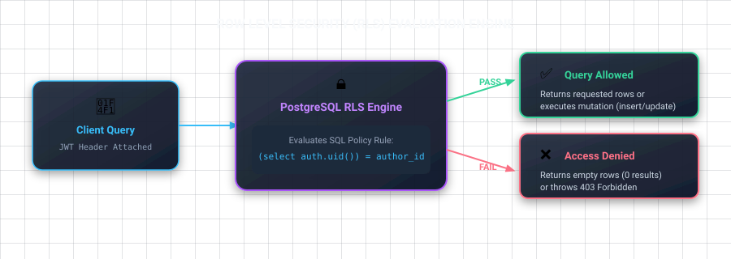

# 04 — Row Level Security (RLS)

## ဒီ chapter မှာ ဘာတွေ လုပ်မှာလဲ

- RLS က ဘာကြောင့် client-direct Supabase ရဲ့ security core ဖြစ်လဲ
- `using` နဲ့ `with check` မတူတာဘာလဲ
- Mont-Sha tables ကို user ownership နဲ့ lock ချမယ်

## RLS ကို Express middleware လို့မြင်ပါ

Express မှာ `requireAuth` middleware နဲ့ `if (recipe.authorId !== req.user.id)` လို့ရေးမယ်။ Supabase မှာ client က database ကို API နဲ့တိုက်ရိုက်မေးတာမို့ အဲဒီ rule ကို **Postgres policy** အနေနဲ့ရေးရတယ်။ ဒါပဲ RLS ပါ။



Publishable key ကို public app ထဲထည့်လို့ရတာ **RLS မှန်နေလို့သာ** ဖြစ်တယ်။ RLS off ထားရင် key ရတဲ့လူတိုင်း table data ကို query လုပ်နိုင်တယ်။

## Policy grammar အလွယ်

```sql
create policy "human readable policy name"
on public.recipes
for select
to authenticated
using (is_published = true);
```

- `for select`: ဘာ rows **ဖတ်ခွင့်**ရှိလဲ, `using (...)` ကိုသုံးတယ်။
- `for update` / `for delete`: target row ကိုခွင့်ပြုဖို့ `using (...)`။
- `for insert`: new row ကိုခွင့်ပြုဖို့ `with check (...)`။
- `for update`: old row `using`, new row `with check` နှစ်ခုလုံးထည့်နိုင်တယ်။
- `auth.uid()` က current logged-in user UUID ကိုပေးတယ်။ Login မရှိရင် `null`။

## Mont-Sha policies

Schema ဆောက်ပြီးနောက် SQL Editor မှာ run ပါ။

```sql
alter table public.profiles enable row level security;
alter table public.recipes enable row level security;
alter table public.comments enable row level security;

-- Profile: users can see profiles, but only alter their own.
create policy "profiles are publicly readable"
on public.profiles for select to anon, authenticated
using (true);

create policy "users insert their own profile"
on public.profiles for insert to authenticated
with check ((select auth.uid()) = id);

create policy "users update their own profile"
on public.profiles for update to authenticated
using ((select auth.uid()) = id)
with check ((select auth.uid()) = id);

-- Recipe: everyone reads published recipes; author controls own drafts.
create policy "published recipes are readable"
on public.recipes for select to anon, authenticated
using (is_published = true or (select auth.uid()) = author_id);

create policy "users create own recipes"
on public.recipes for insert to authenticated
with check ((select auth.uid()) = author_id);

create policy "authors update own recipes"
on public.recipes for update to authenticated
using ((select auth.uid()) = author_id)
with check ((select auth.uid()) = author_id);

create policy "authors delete own recipes"
on public.recipes for delete to authenticated
using ((select auth.uid()) = author_id);

-- Comments: visible when their recipe is visible; author owns writes.
create policy "comments on visible recipes are readable"
on public.comments for select to anon, authenticated
using (
  exists (
    select 1 from public.recipes r
    where r.id = recipe_id
      and (r.is_published = true or r.author_id = (select auth.uid()))
  )
);

create policy "users create own comments"
on public.comments for insert to authenticated
with check ((select auth.uid()) = author_id);

create policy "authors update own comments"
on public.comments for update to authenticated
using ((select auth.uid()) = author_id)
with check ((select auth.uid()) = author_id);

create policy "authors delete own comments"
on public.comments for delete to authenticated
using ((select auth.uid()) = author_id);
```

`(select auth.uid())` style က policy evaluation မှာ function call ကို cache/planner optimize လုပ်နိုင်ဖို့ Supabase docs က recommend လုပ်တဲ့ pattern ပါ။

## Broken policy example

```sql
-- Wrong: any signed-in user can claim any author_id.
create policy "bad recipe insert"
on public.recipes for insert to authenticated
with check (true);
```

ဒီ policy နဲ့ attacker က other user's UUID ကို `author_id` အဖြစ် insert လုပ်နိုင်တယ်။ `with check (auth.uid() = author_id)` က မဖြစ်မနေလိုတယ်။

## Client က user ID ပို့ရတာ?

Insert လုပ်တဲ့အခါ user ID ကို data ထဲ ထည့်ရမယ်; RLS က payload ကို authenticated user နဲ့တူမတူ စစ်မယ်။ Module 05 မှာ code ရေးမယ်။ Client ပို့တဲ့ ID ကို trust လုပ်တာမဟုတ်ဘူး, policy နဲ့ verify လုပ်တာပါ။

## ညီလေး — သတိထားရမယ့်

- RLS enable လုပ်ပြီး policy မရှိရင် API က row အားလုံး deny လုပ်တယ်။ ဒါက bug မဟုတ်ဘူး, secure default ပါ။
- Table Editor/SQL Editor က database owner role နဲ့ run နိုင်လို့ RLS test အစစ်မဟုတ်ဘူး။ publishable client နဲ့ test ပါ။
- `profiles` auto-create trigger ကို Auth module မှာထည့်မယ်။ အခု manually row ထည့်ဖို့မလိုသေးဘူး။

## လေ့ကျင့်ခန်း

Dashboard Table Editor က `recipes` table ကိုဖွင့်ပြီး RLS enabled ဆိုတာစစ်ပါ။ ပြီးရင် login မလုပ်ထားတဲ့ app ကနေ `.from('recipes').select()` ကိုစမ်းပါ။ Published row ပဲရဖို့ expected ပါ။

<< Previous: [03 Database](./03-database-fundamentals.md) | Next: [05 CRUD](./05-crud-with-flutter-and-nextjs.md) >>
