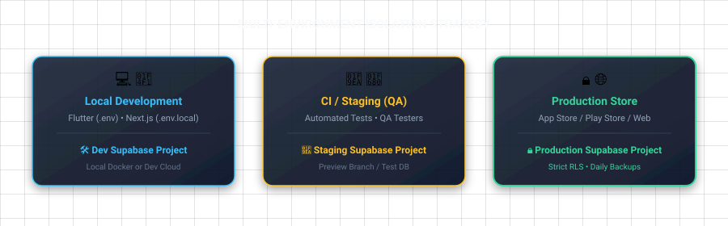
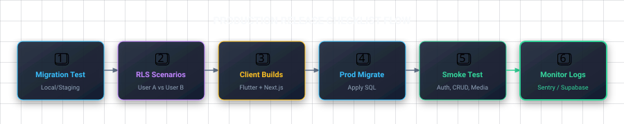

# 11 — Deploy and Production Checklist

## ဒီ chapter မှာ ဘာတွေ လုပ်မှာလဲ

- Production မတင်ခင် security checklist လုပ်မယ်
- performance, environments, monitoring ကိုစဉ်းစားမယ်
- "works on my phone" ကနေ "safe for users" ကိုရွှေ့မယ်

## Security checklist

- [ ] Public/client app မှာ `sb_publishable_...` ပဲရှိတယ်
- [ ] `sb_secret_...` / `service_role` key Git history, app bundle, screenshot တွေထဲမရှိ
- [ ] Public schema app tables တိုင်း RLS enabled
- [ ] Policy တိုင်းကို anonymous user, user A, user B နဲ့ test လုပ်ပြီးပြီ
- [ ] Storage `storage.objects` policies ရှိတယ်
- [ ] Auth redirect URL allow-list မှာ production app URL/deep link ပဲရှိတယ်
- [ ] Edge Function secret တွေ project secrets ထဲပဲရှိတယ်
- [ ] Database constraints (`not null`, FK, checks) critical data မှာရှိတယ်

RLS policy က "UI button မပေါ်ဘူး" ထက်ပိုအရေးကြီးတယ်။ API ကို curl/modified app နဲ့တိုက်လို့ရတာမို့ UI checks ကို security လို့မထင်ပါနဲ့။

## Performance checklist

- [ ] List queries မှာ `.range()` pagination ရှိတယ်
- [ ] `select('*')` မလုပ်ဘဲ required columns ပဲရွေးတယ်
- [ ] frequent filter/join columns မှာ indexes ရှိတယ်
- [ ] Realtime ကို user value ရှိတဲ့ tables/use cases မှာပဲဖွင့်တယ်
- [ ] image size/type limit သတ်မှတ်ထားတယ်
- [ ] large images ကို client upload မတိုင်ခင် resize/compress လုပ်တယ်

Slow query ဖြစ်ရင် guess မလုပ်ပါနဲ့။ Dashboard SQL Editor မှာ `explain analyze` နဲ့ plan ကြည့်, Supabase performance advisors ကို run, query pattern ကိုအရင်နားလည်ပြီးမှ index ထည့်ပါ။

## Environments

Development, staging, production ကို project/env မတူအောင်ထားရင် "test code က real user data ဖျက်" တဲ့ disaster မဖြစ်ဘူး။

Environment တိုင်းမှာ URL, publishable key, redirect URL, OAuth provider credentials မတူနိုင်တယ်။ Environment variables ကို deploy platform secret manager မှာထားပါ။

## Monitoring and recovery

- Dashboard logs: API/Auth/Edge Function errors ကိုစစ်
- Database backups/plan retention ကိုနားလည်
- Error tracker (Sentry လိုမျိုး) ကို client/Edge Function မှာချိတ်
- Secret leak ဖြစ်ရင် key rotate, old key revoke, impacted access review

"Free tier project အလုပ်မလုပ်တော့" case မှာ paused ဖြစ်တာ, quota, error logs, API URL/env typo ကိုအရင်စစ်ပါ။ Retry log တစ်ကြောင်းတည်းကို root cause လို့မဆုံးဖြတ်ပါနဲ့။

## Release flow

## ညီလေး — သတိထားရမယ့်

- Service key leak က password leak ထက်အန္တရာယ်ကြီးတယ်; RLS bypass ဖြစ်နိုင်တယ်။ ချက်ချင်း revoke/rotate လုပ်ပါ။
- Database migration က app code ထက် rollback ခက်တယ်။ Destructive `drop column` မတိုင်ခင် backward-compatible rollout စဉ်းစားပါ။
- Admin action လိုတာကို client RLS policy တစ်ခုနဲ့အလွန်ရှုပ်အောင်မရေးပါနဲ့။ Small trusted Edge Function သုံးတာ ပိုရှင်းနိုင်တယ်။

## လေ့ကျင့်ခန်း

User A နဲ့ unpublished recipe တစ်ခုဆောက်ပါ။ User B/anonymous session နဲ့ read/update/delete မရတာကို Flutter/Next.js မှာအမှန်တကယ်စမ်းပါ။

<< Previous: [10 Migrations](./10-migrations-and-local-dev.md) | Next: [12 Next Steps](./12-next-steps-and-resources.md) >>
