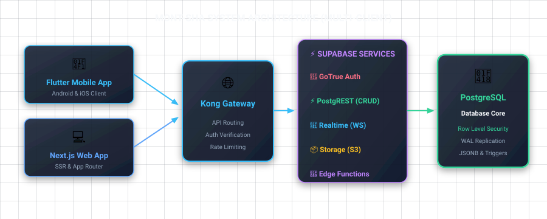

# Supabase Course — မုန့်ရှာ (Mont-Sha) Recipe App

> အကြီးတစ်ယောက်ဆို... junior တစ်ယောက်ကို Supabase ကို အစကနေ production တကယ်တင်တဲ့အထိ လက်တွေ့လုပ်ပြပြီး သင်ပေးတဲ့ course ပါ။
> Burmese ရှင်းပြ + English technical terms ထည့်ထားတယ်။ Code တွေက Flutter နဲ့ Next.js နှစ်ဖက်လုံး။

---

## ညီလေး ဒီ course က ဘာလဲ?

ဒီ course ကို မင်းလိုပဲ backend အကြောင်းသိပြီး၊ Express.js နဲ့ API တွေရေးဖူးတယ်၊ basic SQL သိတယ်၊ Postgres တော့မသိသေးဘူး၊ Supabase ကတော့ မှည့်စပါးပဲ — ဆိုတဲ့သူအတွက် ရေးထားတာပါ။

မင်းပိုင်ထားတဲ့အရာတွေကို ထပ်မပြောချင်ဘူး (HTML, REST, basic SELECT/INSERT တွေ)။ ဒါပေမဲ့ Postgres ရဲ့ ထူးခြားတဲ့ feature တွေ၊ Supabase ရဲ့ architecture၊ "ဘာကြောင့် Express မရေးတော့ဘဲ Supabase သုံးရတာလဲ" ဆိုတာကိုတော့ စုံစုံလင်လင် ဖြေပေးမယ်။

---

## ကျွန်တော်တို့ တည်ဆောက်မယ့် project — မုန့်ရှာ (Mont-Sha)

မုန့်ရှာ ဆိုတာ Burmese recipe တွေမျှဝေတဲ့ social app တစ်ခုပါ။ Features:

- **Auth** — email/password နဲ့ Google sign-in
- **Recipes** — မုန့်ဟင်းနယ်တွေတင်တာ၊ ဓာတ်ပုံတွေပါတယ်
- **Comments** — အချင်းချင်း comment ရေးတာ
- **Realtime** — လူတစ်ယောက် comment ရေးလိုက်တာနဲ့ ချက်ချင်းပေါ်တာ
- **Storage** — recipe ပုံတွေ upload လုပ်တာ

နှစ်ဖက် client တွေကို တည်ဆောက်မယ် — **Flutter (mobile)** နဲ့ **Next.js (web)** — ဒီနှစ်ခုလုံးက **Supabase project တစ်ခုတည်း**ကို ချိတ်မယ်။ ဒါကြောင့် "multi-client architecture ဘယ်လိုလုပ်ရမလဲ" ဆိုတာပါ လက်တွေ့မြင်ရမယ်။

---

## Prerequisites — ဒီတွေကိုတော့ ထားပေးပါ

- Node.js 18+ (Next.js အတွက်)
- Flutter 3.x SDK + Dart
- Supabase account တစ်ခု (supabase.com မှာ free tier အနေနဲ့ အရင်ဖန်တီးပါ)
- သိထားရမယ့်: basic SQL, REST API concept, Flutter widget tree, React hook အခြေခံ

---

## Course Structure

| # | File | အကြောင်းအရာ |
|---|------|-----------|
| 0 | `README.md` | ဒီဖိုင်ပါပဲ — course intro + table of contents |
| 1 | `01-supabase-overview.md` | Supabase ဆိုတာဘာလဲ၊ architecture၊ ဘယ်လို အလုပ်လုပ်လဲ |
| 2 | `02-project-setup-recap.md` | Project setup recap + env + key အမျိုးအစားတွေ |
| 3 | `03-database-fundamentals.md` | Postgres fundamentals + ပထမဆုံး tables တွေဖန်တီးတာ |
| 4 | `04-row-level-security.md` | Row Level Security (RLS) — အရေးအကြီးဆုံး chapter |
| 5 | `05-crud-with-flutter-and-nextjs.md` | CRUD operations Flutter + Next.js နဲ့ |
| 6 | `06-auth-deep-dive.md` | Authentication deep dive — GoTrue |
| 7 | `07-storage-for-media.md` | Storage — ပုံတွေ upload လုပ်တာ |
| 8 | `08-realtime.md` | Realtime subscriptions |
| 9 | `09-edge-functions.md` | Edge Functions — ဘာကြောင့်လိုအပ်လဲ |
| 10 | `10-migrations-and-local-dev.md` | Supabase CLI + local dev + migrations |
| 11 | `11-deploy-and-production-checklist.md` | Production checklist |
| 12 | `12-next-steps-and-resources.md` | နောက်ထပ်သွားရမယ့်နေရာတွေ |

---

## ဘယ်လိုဖတ်ရမလဲ?

1. စဉ်တိုင်း ဖတ်ပါ — module တွေက တစ်ခုပေါ်တစ်ခု ဆင့်ထားတယ်။ Module 5 ကို မရောက်ခင် Module 4 (RLS) ကို မဖြတ်ပါနဲ့။
2. Code တွေကို copy-paste လုပ်ပြီး လက်တွေ့ အရင် run ကြည့်ပါ။ မျက်စိနဲ့ဖတ်ရုံနဲ့ မရဘူး။
3. အဆင့်ဆင့်လုပ် — README က 5 မိနစ်၊ Module တစ်ခုက 30-60 မိနစ်လောက်ယူမယ်။
4. Stuck ဖြစ်နေရင် ပြန်ဖတ်ပါ။ အထူးသဖြင့် Module 4 (RLS) နဲ့ Module 6 (Auth) က concept ခက်တယ်။

---

## Course Rules — သတိထားပါ

1. **Dashboard မှာ schema မပြင်နဲ့ (ဆက်ဖတ်ပါ)** — Module 10 ရောက်တဲ့အခါ migrations ကို CLI ကနေ လုပ်မယ်။ အစပိုင်းမှာ dashboard သုံးလို့ရပေမဲ့၊ နောက်ပိုင်း မှားသွားရင် ပြန်မပြင်လို့ပါ။
2. **service_role key ကို client app ထဲ ထည့်မပါနဲ့** — Module 2 မှာ ရှင်းပြမယ်။
3. **RLS ကို မပိတ်နဲ့** — production မှာ security ပြိုကုန်မယ်။

---

## အသင့်ဖြစ်ပြီလား?

ဆက်ပြီး `01-supabase-overview.md` ကို ဖတ်လိုက်ပါ။ စသွားမယ်။ 🚀
